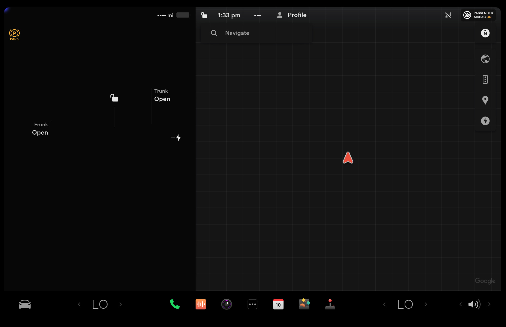

# Telsa on QEMU

## Requirements

- Linux
- QEMU
- A Tesla firmware image (e.g: `./firmware/2024.20.9.mcu2` = `499b7435e36d18476647838f3d7fbac6`)

## Setup

```bash
sudo ip tuntap add dev tap0 mode tap
sudo ip link set tap0 up
sudo ip addr add 192.168.90.5/24 dev tap0
```


## Build QEMU image

```bash
./build.sh firmware/2024.20.9.mcu2
```

## Build the ramdisk

----- OUTDATED -----
TODO: Update this section

## Start

```bash
./start.sh
```

In another window, you can use SSH to connect to the VM:

```bash
ssh root@192.168.90.100
```

Password for root is... `root`.

## Starting the UI

Now that you have access to your VM, you can send the scripts to it:

```bash
scp -r ./scripts root@192.168.90.100:/root
```

In the QEMU terminal, you can start X:

```bash
/root/scripts/start-x.sh
```

### Starting QtCar

> [!WARNING]  
> This will start QtCar as root. It's probably a better idea to copy the script to `/home/tesla/` and then `sudo -u tesla /home/tesla/start-qtcar.sh` to run it.

Via SSH, you can run the script to start QtCar:

```bash
/root/scripts/start-qcar.sh
```

If everything works well, you should see the QtCar UI:




## Known Issues

### Touch doesn't work

It is currently not possible to interact with the UI from the QEMU window. The UI is running
and answers to the server command (e.g: displaying a message window) - but it cannot currently
be interacted with.

It looks like the UI uses a custom input device driver (not relying directly on evdev) that
is part of the kernel (`tesla-uinput`?).


### UI looks odd

Since pretty much none of the other services are started, the UI doesn't show the car graphics,
or the map, or the E112 UI. This is normal and simply means that we have to integrate / start
those services to have a fully working UI.
